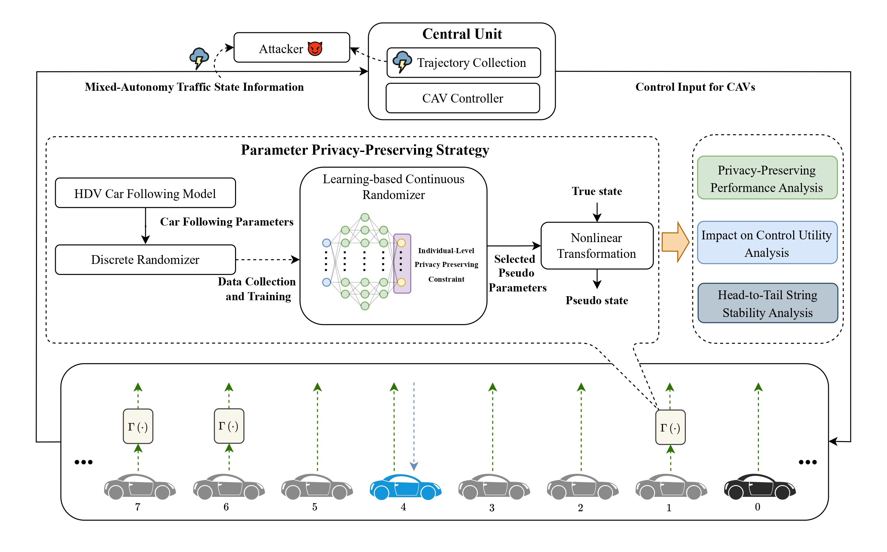

# Preserving Parameter Privacy for Mixed-Autonomy Traffic
Code for the paper "A Parameter Privacy-Preserving Strategy for Mixed-Autonomy Platoon Control" (Transportation Research Part C)
[[PDF](https://arxiv.org/abs/2401.15561)]



**Abstract:**

> It has been demonstrated that leading cruise control (LCC) can improve the operation of mixed-autonomy platoons by allowing connected and automated vehicles (CAVs) to make longitudinal control decisions based on the information provided by surrounding vehicles. However, LCC generally requires surrounding human-driven vehicles (HDVs) to share their real-time states,  which can be used by adversaries to infer drivers' car-following behavior, potentially leading to financial losses or safety concerns. This paper aims to address such privacy concerns and protect the behavioral characteristics of HDVs by devising a parameter privacy-preserving approach for mixed-autonomy platoon control. First,  we integrate a parameter privacy filter into LCC to protect sensitive car-following parameters. The privacy filter allows each vehicle to generate seemingly realistic pseudo states by distorting the true parameters to pseudo parameters, which can protect drivers' privacy in behavioral parameters without significantly influencing the control performance. Second, to enhance the reliability and practicality of the privacy filter within LCC, we first introduce an individual-level parameter privacy preservation constraint to the privacy filter, focusing on the privacy level of each individual parameter pair. Subsequently, we extend the current approach to accommodate continuous parameter spaces through a neural network estimator. Third, analysis of head-to-tail string stability reveals the potential impact of privacy filters in degrading mixed traffic flow performance. Simulation shows that this approach can effectively trade off privacy and control performance in LCC. We further demonstrate the benefit of such an approach in networked systems, i.e.,  by applying the privacy filter to a preceding vehicle, one can also achieve a certain level of privacy for the following vehicle. 

### Run

1. Privacy-preserving performance (discrete privacy filter):
```
PrivacyPerformance/Simulation_I0_scenario1.m
PrivacyPerformance/Simulation_I0_scenario2.m
PrivacyPerformance/Simulation_I0_scenario3.m
PrivacyPerformance/Simulation_Timestep_scenario1.m
PrivacyPerformance/Simulation_Timestep_scenario2.m
PrivacyPerformance/Simulation_Timestep_scenario3.m
```
2. Privacy-preserving performance (continuous privacy filter):
```
ContinuesPrivacyFilter/Simulation_I0_scenario1.m
ContinuesPrivacyFilter/Simulation_I0_scenario2.m
ContinuesPrivacyFilter/Simulation_I0_scenario3.m
ContinuesPrivacyFilter/Simulation_Timestep_scenario1.m
ContinuesPrivacyFilter/Simulation_Timestep_scenario2.m
ContinuesPrivacyFilter/Simulation_Timestep_scenario3.m
```
3. Privacy-utility trade-off analysis

```
ContinuesPrivacyFilter/ControlPerformanceAnalysis.m
ContinuesPrivacyFilter/Disturbance_Analysis.m
```

4. Head-to-tail string stability analysis

```
StringStabilityAnalysis/StringStableRegion_different_kappa.m
StringStabilityAnalysis/StringStableRegion_different_pseudo_parameter.m
```

### Note

This project is inspired by [Leading Cruise Control](https://github.com/soc-ucsd/LCC).

### Citation

> Zhou, J., Yang, K., 2024. A Parameter Privacy-Preserving Strategy for Mixed-Autonomy Platoon Control. Transportation Research Part C: Emerging Technologies .
